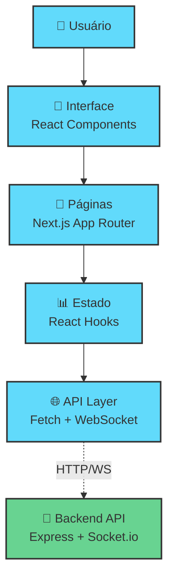
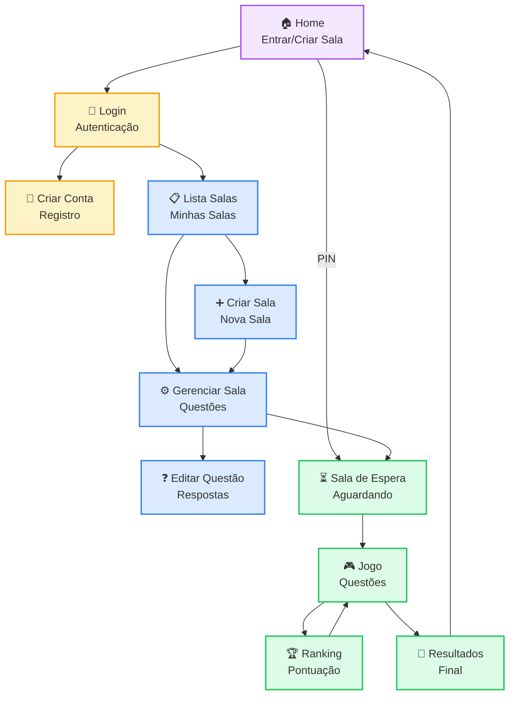
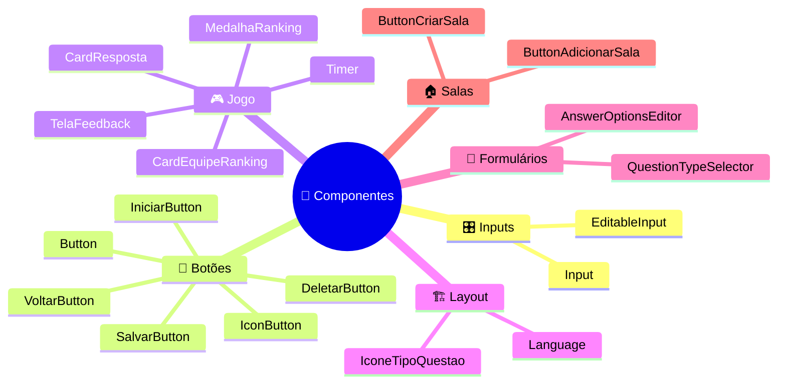
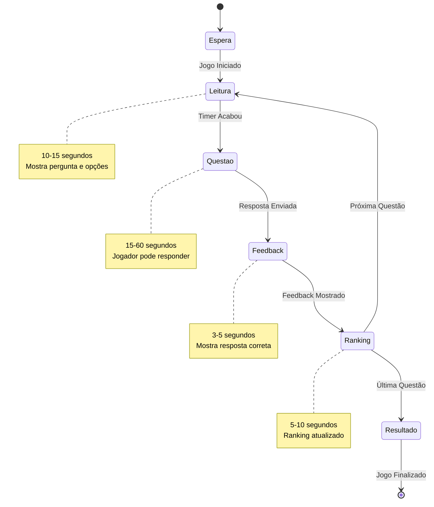

# 🖥️ Frontend do Sabixão

## 📊 Arquitetura do Sistema



## 🔄 Fluxo de Navegação



## 🧩 Componentes Reutilizáveis



## 📁 Estrutura de Pastas

```
frontend/
├── 📄 app/                          # Páginas (App Router)
│   ├── 🏠 page.tsx                  # Home - Entrar/Criar Sala
│   ├── 🔐 login/page.tsx            # Login
│   ├── 📝 criar-conta/page.tsx      # Registro
│   ├── 📋 lista-salas/page.tsx      # Minhas Salas
│   ├── ➕ criar-sala/page.tsx       # Nova Sala
│   ├── ⚙️ sala/[id]/page.tsx        # Gerenciar Sala
│   ├── ❓ editar-questao/page.tsx   # Editar Questão
│   ├── ⏳ espera/[salaId]/page.tsx  # Sala de Espera
│   ├── 🎮 jogar/[salaId]/           # Área de Jogo
│   │   ├── page.tsx                 # Controller do Jogo
│   │   └── components/              # Componentes do Jogo
│   │       ├── tela-leitura.tsx     # Leitura da Questão
│   │       ├── tela-questao.tsx     # Responder Questão
│   │       ├── tela-ranking.tsx     # Ranking Parcial
│   │       └── tela-feedback.tsx    # Feedback da Resposta
│   └── 🎯 resultados/[salaId]/      # Resultados Finais
├── 🧩 components/                   # Componentes Reutilizáveis
│   ├── button.tsx                   # Botão padrão
│   ├── input.tsx                    # Input padrão
│   ├── timer.tsx                    # Timer circular
│   ├── card-resposta.tsx            # Card de resposta
│   └── ...                         # Outros componentes
├── 🖼️ public/images/               # Imagens estáticas
└── 🎨 globals.css                  # Estilos globais
```

## 🎨 Sistema de Design

### 🎨 Paleta de Cores
```css
/* Cores Principais */
--primary-blue: #077DD7;     /* Botões principais */
--secondary-blue: #0561B0;   /* Hover states */
--success-green: #10b981;    /* Respostas corretas */
--error-red: #EF4444;        /* Respostas erradas */
--warning-yellow: #F59E0B;   /* Avisos */

/* Cores de Resposta */
--red-circle: #EF4444;       /* Círculo vermelho */
--blue-triangle: #3B82F6;    /* Triângulo azul */
--green-star: #5A993C;       /* Estrela verde */
--yellow-square: #F59E0B;    /* Quadrado amarelo */
```

### 🖼️ Backgrounds
- **Home/Login:** `background.png`
- **Jogo:** `background2.png`, `background3.png` (alternados)
- **Resultados:** `background-podium.png`
- **Espera:** `background-wait.png`

### ✏️ Tipografia
- **Font Family:** Baloo 2 (Google Fonts)
- **Pesos:** 400, 500, 600, 700, 800

## 🔌 Comunicação com Backend

### 📡 HTTP Requests
```javascript
// Autenticação
POST /api/auth/login
POST /api/auth/register

// Salas
GET /api/salas
POST /api/salas
PUT /api/salas/:id
DELETE /api/salas/:id

// Questões
GET /api/salas/:id/questoes
POST /api/salas/:id/questoes
PUT /api/questoes/:id
DELETE /api/questoes/:id
```

### ⚡ WebSocket Events
```javascript
// Conectar à sala
socket.emit('join-room', { salaId, playerName })

// Eventos do jogo
socket.on('game-started', handleGameStart)
socket.on('question-started', handleNewQuestion)
socket.on('ranking-update', handleRankingUpdate)
socket.on('game-ended', handleGameEnd)

// Enviar resposta
socket.emit('submit-answer', { 
  questaoId, 
  opcaoId, 
  timeUsed 
})
```

## 🎮 Estados do Jogo



## 📋 Stack Tecnológico

| Componente | Tecnologia | Versão | Propósito |
|------------|------------|--------|-----------|
| **Framework** | Next.js | 14+ | React com SSR/SSG |
| **Linguagem** | TypeScript | 5+ | Tipagem estática |
| **Estilização** | CSS Modules | - | Estilos isolados |
| **Font** | Baloo 2 | - | Tipografia amigável |
| **Icons** | React Icons | 4+ | Ícones padronizados |
| **WebSocket** | Socket.io Client | 4+ | Tempo real |
| **Linting** | ESLint | 8+ | Qualidade de código |

## 🚀 Como Executar

```bash
# Instalar dependências
npm install

# Executar em desenvolvimento
npm run dev

# Build para produção
npm run build

# Executar versão de produção
npm start

# Aplicação estará em http://localhost:3000
```

## 📱 Responsividade

### 🖥️ Desktop (>768px)
- Layout completo com sidebars
- Botões grandes e espaçados
- Logo em tamanho padrão

### 📱 Mobile (<768px)
- Layout stack vertical
- Botões adaptados para touch
- Logo redimensionada
- Navegação simplificada

## 🧪 Testes de Componentes

### 🎯 Componentes Críticos
- ✅ Timer - Contagem regressiva precisa
- ✅ CardResposta - Seleção correta
- ✅ WebSocket - Conexão estável
- ✅ Navegação - Rotas funcionais

### 🔍 Cenários de Teste
1. **Fluxo Completo:** Home → Login → Criar Sala → Jogo → Resultados
2. **Multiplayer:** Múltiplos jogadores simultâneos
3. **Responsivo:** Todos os breakpoints
4. **Offline:** Tratamento de erros de conexão

## 🎯 Melhorias Futuras

### 🔮 Funcionalidades Planejadas
- 🌍 **Internacionalização** - Múltiplos idiomas
- 🎵 **Sons e Música** - Feedback sonoro
- 🏆 **Histórico de Partidas** - Estatísticas pessoais
- 🎨 **Temas Personalizáveis** - Dark/Light mode
- 📊 **Analytics** - Métricas de uso
- 💾 **Cache Offline** - PWA capabilities

---

**🎮 Frontend pronto para diversão multiplayer!** 🚀
